# Jak pobrać projekt?
## Uruchomienie lokalne
1. Sklonuj repozytorium przy użyciu poniższej komendy:
```bash
git clone https://github.com/PJATK-ASI-2024/Lab-3-4_s24353.git
```
2. Otwórz projekt w swoim preferowanym IDE (Integrated Development Environment) takim jak PyCharm czy VS Code.
3. Zainstaluj potrzebne dependencje:
```bash
pip install -r requirements.txt
```
4. Repozytorium powinno zawierać gotowy model (`model.pkl`) do odpalenia. Jeżeli jednak tak by się nie stało, jesteś w stanie wygenerować model poprzez odpalenie `feature_engineering.py`, a następnie `model_training.py`
5. Odpal `app.py`. Aplikacja powinna słuchać na porcie 5000.
6. Wyślij przykładowe zapytanie do aplikacji z użyciem cURL'a na endpoint `/predict`. Aplikacja przyjmuje zapytania w postaci CSV czy JSON.
7. Przykłady zapytań:

`JSON`
```bash
curl -X POST http://localhost:5000/predict -H "Content-Type: application/json" -d '[
    {
        "gender": "female",
        "ethnicity": "other",
        "fcollege": "no",
        "mcollege": "no",
        "home": "yes",
        "urban": "yes",
        "unemp": 5.90,
        "wage": 8.09,
        "distance": 3.0,
        "tuition": 0.889,
        "education": 15,
        "income": "low",
        "region": "other"
    }
]'
```
`CSV`
```bash
curl -X POST http://localhost:5000/predict -H "Content-Type: text/csv" --data-binary 'gender,ethnicity,fcollege,mcollege,home,urban,unemp,wage,distance,tuition,education,income,region
female,other,no,no,yes,yes,5.90,8.09,3.0,0.889,15,low,other'
```
## Uruchomienie przy użyciu Docker'a
1. Pobierz najnowszy obraz z DockerHub'a:
```bash
docker pull serafinski/asi-04:latest
```
2. Uruchom kontener z pobranym obrazem (wymaga otwarcia portu 5000 - jeżeli zajęty można zmienić go na dowolny inny: `[twoj_port]:5000`):
```bash
docker run -p 5000:5000 serafinski/asi-04:latest
```
3. Wyślij przykładowe zapytanie do aplikacji z użyciem cURL'a na endpoint `/predict`. Aplikacja przyjmuje zapytania w postaci CSV czy JSON.
4. Przykłady zapytań:

`JSON`
```bash
curl -X POST http://localhost:5000/predict -H "Content-Type: application/json" -d '[
    {
        "gender": "female",
        "ethnicity": "other",
        "fcollege": "no",
        "mcollege": "no",
        "home": "yes",
        "urban": "yes",
        "unemp": 5.90,
        "wage": 8.09,
        "distance": 3.0,
        "tuition": 0.889,
        "education": 15,
        "income": "low",
        "region": "other"
    }
]'
```
`CSV`
```bash
curl -X POST http://localhost:5000/predict -H "Content-Type: text/csv" --data-binary 'gender,ethnicity,fcollege,mcollege,home,urban,unemp,wage,distance,tuition,education,income,region
female,other,no,no,yes,yes,5.90,8.09,3.0,0.889,15,low,other'
```
# Raport z Analizy Danych
### Ostatnia aktualizacja: Mon Oct 21 23:28:16 CEST 2024
## Przed Czyszczeniem Danych
### Braki w danych:
| index | Missing Values | Missing Percentage |
| --- | --- | --- |
| rownames | 0 | 0.0 |
| gender | 0 | 0.0 |
| ethnicity | 0 | 0.0 |
| score | 0 | 0.0 |
| fcollege | 0 | 0.0 |
| mcollege | 0 | 0.0 |
| home | 0 | 0.0 |
| urban | 0 | 0.0 |
| unemp | 0 | 0.0 |
| wage | 0 | 0.0 |
| distance | 0 | 0.0 |
| tuition | 0 | 0.0 |
| education | 0 | 0.0 |
| income | 0 | 0.0 |
| region | 0 | 0.0 |
### Opis statystyczny danych numerycznych
| index | count | mean | std | min | 25% | 50% | 75% | max |
| --- | --- | --- | --- | --- | --- | --- | --- | --- |
| score | 4739.0 | 50.88902933684601 | 8.701909614072397 | 28.950000762939453 | 43.92499923706055 | 51.18999862670898 | 57.76999855041504 | 72.80999755859375 |
| unemp | 4739.0 | 7.597214581091511 | 2.763580873344847 | 1.399999976158142 | 5.900000095367432 | 7.099999904632568 | 8.899999618530273 | 24.899999618530277 |
| wage | 4739.0 | 9.500506478338005 | 1.3430670761078358 | 6.590000152587891 | 8.850000381469727 | 9.68000030517578 | 10.149999618530272 | 12.960000038146973 |
| distance | 4739.0 | 1.8028698056546362 | 2.297127839272774 | 0.0 | 0.4000000059604645 | 1.0 | 2.5 | 20.0 |
| tuition | 4739.0 | 0.8146082493518823 | 0.3395038198597169 | 0.2575100064277649 | 0.4849900007247925 | 0.8244799971580505 | 1.127020001411438 | 1.4041600227355957 |
| education | 4739.0 | 13.807765351339945 | 1.7891065138770221 | 12.0 | 12.0 | 13.0 | 16.0 | 18.0 |
### Opis zmiennych kategorycznych
| index | count | unique | top | freq |
| --- | --- | --- | --- | --- |
| gender | 4739 | 2 | female | 2600 |
| ethnicity | 4739 | 3 | other | 3050 |
| fcollege | 4739 | 2 | no | 3753 |
| mcollege | 4739 | 2 | no | 4088 |
| home | 4739 | 2 | yes | 3887 |
| urban | 4739 | 2 | no | 3635 |
| income | 4739 | 2 | low | 3374 |
| region | 4739 | 2 | other | 3796 |
### Dystrybucja zmiennych kategorycznych
Dystrybucja dla zmiennej gender:

| gender | count |
| --- | --- |
| female | 2600 |
| male | 2139 |

Dystrybucja dla zmiennej ethnicity:

| ethnicity | count |
| --- | --- |
| other | 3050 |
| hispanic | 903 |
| afam | 786 |

Dystrybucja dla zmiennej fcollege:

| fcollege | count |
| --- | --- |
| no | 3753 |
| yes | 986 |

Dystrybucja dla zmiennej mcollege:

| mcollege | count |
| --- | --- |
| no | 4088 |
| yes | 651 |

Dystrybucja dla zmiennej home:

| home | count |
| --- | --- |
| yes | 3887 |
| no | 852 |

Dystrybucja dla zmiennej urban:

| urban | count |
| --- | --- |
| no | 3635 |
| yes | 1104 |

Dystrybucja dla zmiennej income:

| income | count |
| --- | --- |
| low | 3374 |
| high | 1365 |

Dystrybucja dla zmiennej region:

| region | count |
| --- | --- |
| other | 3796 |
| west | 943 |

### Histogram dla Score
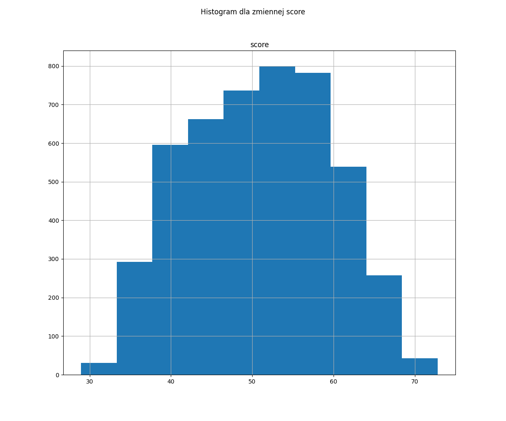
### Wykresy Punktowe
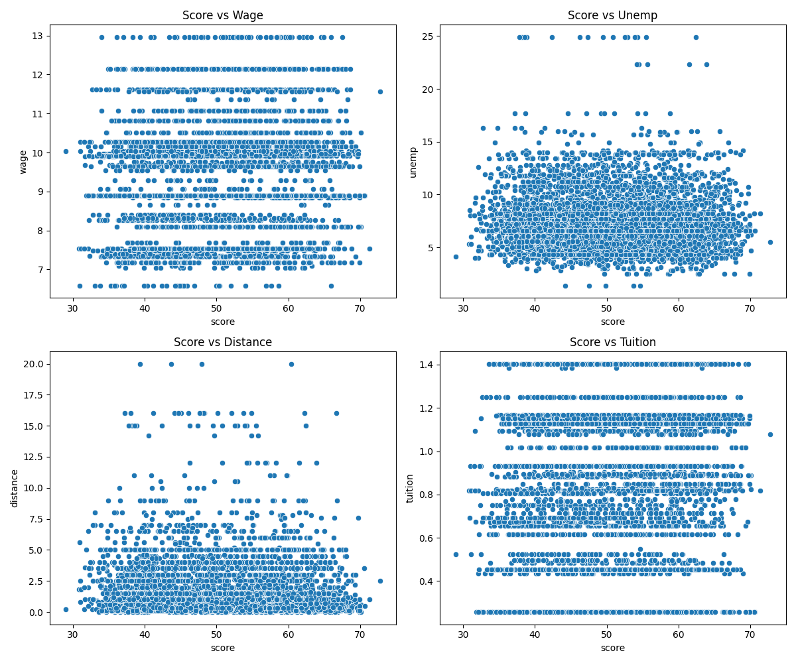
### Zmienne Kategoryczne
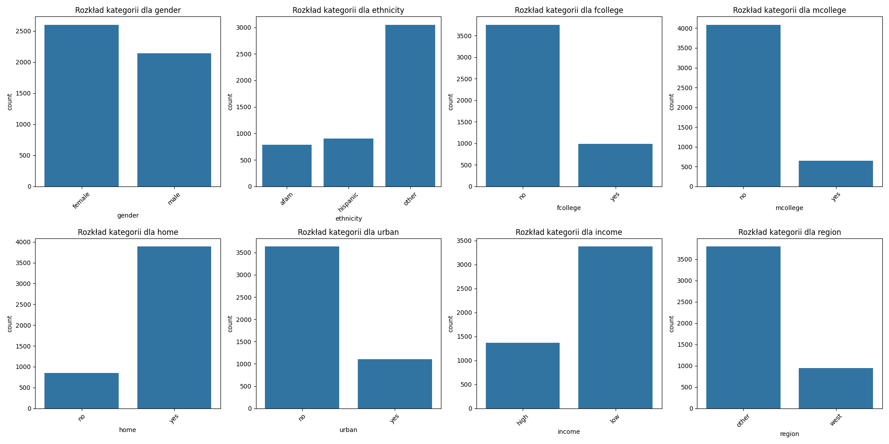
### Heatmap'a Korelacji
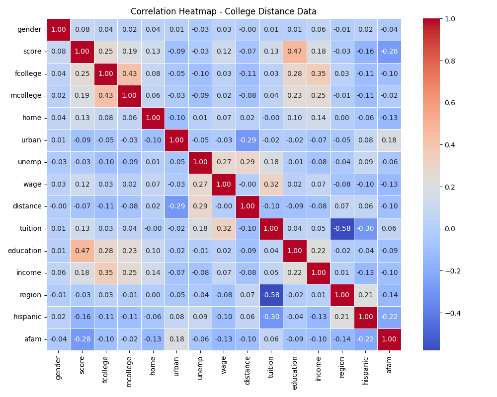
## Po Czyszczeniu Danych
### Opis statystyczny danych numerycznych
| index | count | mean | std | min | 25% | 50% | 75% | max |
| --- | --- | --- | --- | --- | --- | --- | --- | --- |
| score | 3143.0 | 50.6351988686523 | 7.995090328411187 | 31.600000381469727 | 44.27999877929688 | 50.77999877929688 | 56.63999938964844 | 70.0999984741211 |
| unemp | 3143.0 | 7.456188343908617 | 2.4841456009743554 | 1.399999976158142 | 5.699999809265137 | 7.0 | 8.550000190734863 | 17.700000762939453 |
| wage | 3143.0 | 9.478211945574108 | 1.322298568987108 | 6.590000152587891 | 8.850000381469727 | 9.68000030517578 | 10.149999618530272 | 12.960000038146973 |
| distance | 3143.0 | 1.4799872752548098 | 1.5082260306063295 | 0.0 | 0.4000000059604645 | 1.0 | 2.0 | 7.800000190734863 |
| tuition | 3143.0 | 0.817914026294815 | 0.33826413846167924 | 0.2575100064277649 | 0.4953800141811371 | 0.8244799971580505 | 1.127020001411438 | 1.4041600227355957 |
| education | 3143.0 | 13.819917276487432 | 1.780443409044756 | 12.0 | 12.0 | 13.0 | 16.0 | 18.0 |
### Opis zmiennych kategorycznych
Ethnicity rozdzielono na hispanic i afam
| index | count | unique | top | freq |
| --- | --- | --- | --- | --- |
| gender | 3143 | 2 | female | 1748 |
| fcollege | 3143 | 2 | no | 2540 |
| mcollege | 3143 | 2 | no | 2803 |
| home | 3143 | 2 | yes | 2637 |
| urban | 3143 | 2 | no | 2400 |
| income | 3143 | 2 | low | 2257 |
| region | 3143 | 2 | other | 2550 |
| hispanic | 3143 | 2 | non-hispanic | 2545 |
| afam | 3143 | 2 | non-afam | 2613 |
### Dystrybucja zmiennych kategorycznych
Dystrybucja dla zmiennej gender:

| gender | count |
| --- | --- |
| female | 1748 |
| male | 1395 |

Dystrybucja dla zmiennej fcollege:

| fcollege | count |
| --- | --- |
| no | 2540 |
| yes | 603 |

Dystrybucja dla zmiennej mcollege:

| mcollege | count |
| --- | --- |
| no | 2803 |
| yes | 340 |

Dystrybucja dla zmiennej home:

| home | count |
| --- | --- |
| yes | 2637 |
| no | 506 |

Dystrybucja dla zmiennej urban:

| urban | count |
| --- | --- |
| no | 2400 |
| yes | 743 |

Dystrybucja dla zmiennej income:

| income | count |
| --- | --- |
| low | 2257 |
| high | 886 |

Dystrybucja dla zmiennej region:

| region | count |
| --- | --- |
| other | 2550 |
| west | 593 |

Dystrybucja dla zmiennej hispanic:

| hispanic | count |
| --- | --- |
| non-hispanic | 2545 |
| hispanic | 598 |

Dystrybucja dla zmiennej afam:

| afam | count |
| --- | --- |
| non-afam | 2613 |
| afam | 530 |

### Histogram dla Score
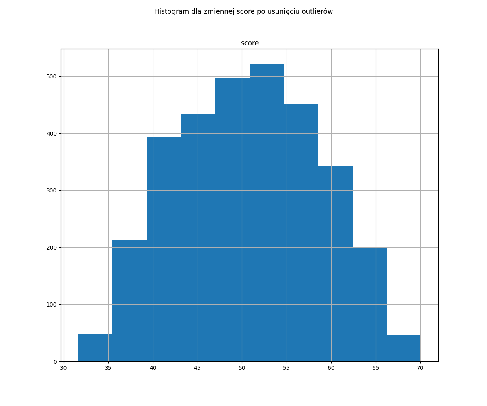
### Wykresy Punktowe
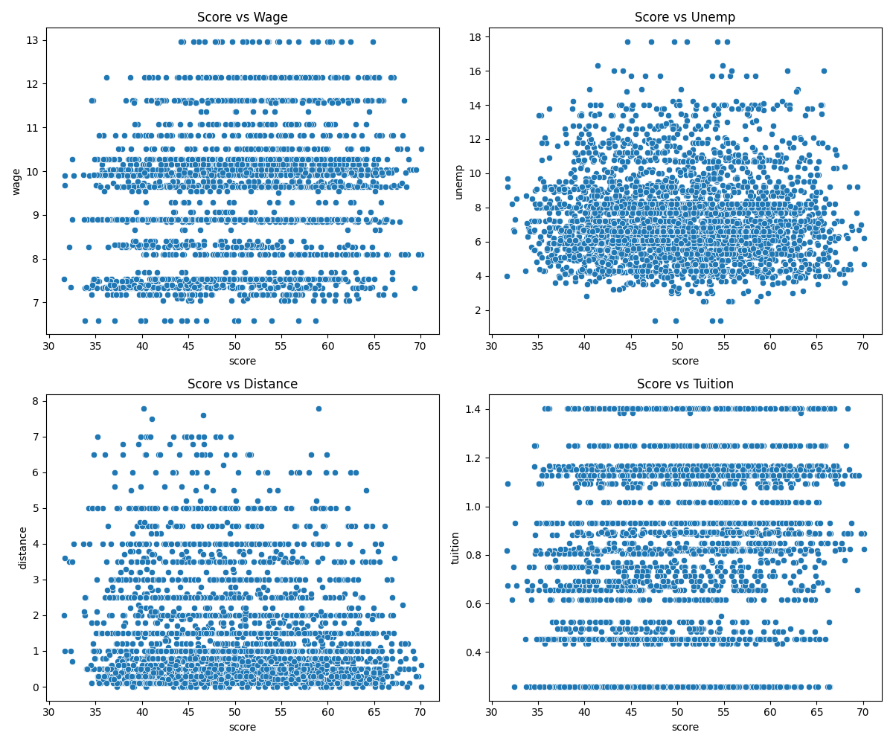
### Zmienne Kategoryczne
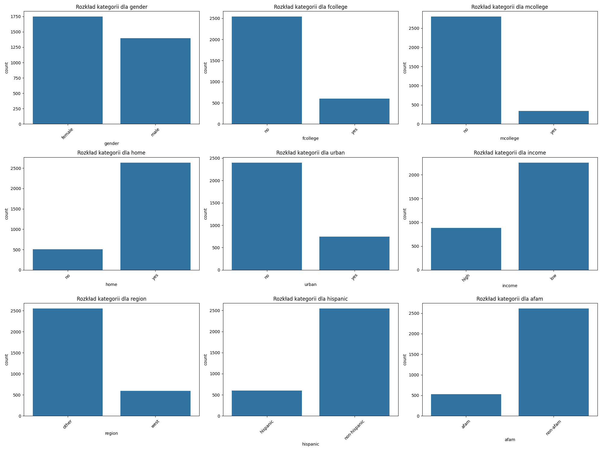
## Wybór modelu przy użyciu AutoML - PyCaret
PyCaret podzieli dane na w stosunku 80/20 gdzie 80% to dane treningowe: `train_size=0.8`
### Metryki modeli
Najlepszy model został wybrany wg. poniższych metryk oceny modelu:
* MAE (Mean Absolute Error): Średnia wartość bezwzględnych różnic między rzeczywistymi a przewidywanymi wartościami. Im niższa wartość, tym lepsze dopasowanie modelu. Mniejsza wartość MAE oznacza lepszy model.
* MSE (Mean Squared Error): Średnia kwadratów różnic między rzeczywistymi a przewidywanymi wartościami. Większa waga jest nadawana większym błędom. Mniejsza wartość MSE jest lepsza, ponieważ oznacza mniej odchyleń.
* RMSE (Root Mean Squared Error): Pierwiastek kwadratowy z MSE. Daje wynik w tej samej skali co dane. Mniejsza wartość RMSE oznacza lepsze dopasowanie modelu.
* R^2 (R-Squared): Proporcja wariancji w zależnej zmiennej wyjaśnionej przez model. Im wyższa wartość R^2, tym lepsze dopasowanie modelu. R^2 bliskie 1 oznacza bardzo dobre dopasowanie.
* RMSLE (Root Mean Squared Log Error): Pierwiastek kwadratowy z błędu logarytmicznego. Mniejsza wartość RMSLE jest lepsza, szczególnie w przypadku, gdy zależy nam na karaniu większych błędów bardziej, ale ignorowaniu małych różnic.
* MAPE (Mean Absolute Percentage Error): Średnia procentowa różnica między rzeczywistymi a przewidywanymi wartościami. Mniejsza wartość MAPE oznacza lepszy model, ponieważ mniejsze są odchylenia procentowe między przewidywanymi a rzeczywistymi wartościami.
* TT (Sec) (Train Time): Całkowity czas treningu modelu. Mniejszy czas TT oznacza szybszy model, co jest korzystne, szczególnie w przypadku dużych zbiorów danych lub konieczności szybkich predykcji.

| Model | MAE | MSE | RMSE | R2 | RMSLE | MAPE | TT (Sec) |
| --- | --- | --- | --- | --- | --- | --- | --- |
| Bayesian Ridge | 3.4418 | 16.7215 | 4.0864 | 0.7404 | 0.0816 | 0.0699 | 0.043 |
| Ridge Regression | 3.4434 | 16.7336 | 4.0879 | 0.7403 | 0.0816 | 0.0699 | 0.044 |
| Linear Regression | 3.4439 | 16.7371 | 4.0883 | 0.7402 | 0.0816 | 0.0699 | 0.313 |
| Huber Regressor | 3.4456 | 16.799 | 4.0957 | 0.7393 | 0.0817 | 0.0699 | 0.045 |
| Least Angle Regression | 3.4797 | 17.1433 | 4.1366 | 0.7338 | 0.0825 | 0.0706 | 0.043 |
| Gradient Boosting Regressor | 3.4786 | 17.2348 | 4.1488 | 0.7325 | 0.0828 | 0.0706 | 0.066 |
| AdaBoost Regressor | 3.5634 | 18.0398 | 4.2437 | 0.7202 | 0.0845 | 0.0724 | 0.06 |
| Light Gradient Boosting Machine | 3.5587 | 18.4976 | 4.2984 | 0.7127 | 0.0856 | 0.0721 | 38.136 |
| CatBoost Regressor | 3.5603 | 18.5392 | 4.3032 | 0.7121 | 0.0859 | 0.0722 | 1.147 |
| Random Forest Regressor | 3.6788 | 19.8965 | 4.4578 | 0.691 | 0.0893 | 0.0747 | 0.132 |
| Lasso Least Angle Regression | 3.8145 | 20.9859 | 4.5756 | 0.6751 | 0.0922 | 0.0784 | 0.042 |
| Lasso Regression | 3.8145 | 20.9859 | 4.5756 | 0.6751 | 0.0922 | 0.0784 | 0.159 |
| Extreme Gradient Boosting | 3.8463 | 22.2927 | 4.7193 | 0.6536 | 0.094 | 0.0779 | 0.069 |
| Elastic Net | 4.0023 | 22.8955 | 4.7798 | 0.6456 | 0.0963 | 0.0825 | 0.044 |
| Extra Trees Regressor | 3.9074 | 22.856 | 4.778 | 0.6452 | 0.0957 | 0.0795 | 0.115 |
| K Neighbors Regressor | 3.9982 | 24.5009 | 4.9438 | 0.6208 | 0.0986 | 0.0813 | 0.045 |
| Orthogonal Matching Pursuit | 4.3045 | 27.6966 | 5.2558 | 0.5708 | 0.106 | 0.0886 | 0.041 |
| Decision Tree Regressor | 4.7585 | 34.2151 | 5.8469 | 0.4677 | 0.1169 | 0.0964 | 0.044 |
| Passive Aggressive Regressor | 4.8538 | 35.7563 | 5.9547 | 0.448 | 0.1189 | 0.0978 | 0.043 |
| Dummy Regressor | 6.7734 | 64.8791 | 8.0513 | -0.0056 | 0.1592 | 0.1393 | 0.143 |
### Metryki dla tuningowanego modelu
| Fold | MAE | MSE | RMSE | R2 | RMSLE | MAPE |
| --- | --- | --- | --- | --- | --- | --- |
| 0 | 3.0145 | 13.7863 | 3.713 | 0.7715 | 0.0743 | 0.0615 |
| 1 | 3.358 | 16.5985 | 4.0741 | 0.7664 | 0.0811 | 0.0683 |
| 2 | 3.4239 | 16.8128 | 4.1003 | 0.727 | 0.0822 | 0.0702 |
| 3 | 3.5197 | 17.0306 | 4.1268 | 0.727 | 0.0851 | 0.0736 |
| 4 | 3.6289 | 17.9823 | 4.2406 | 0.7225 | 0.0841 | 0.0732 |
| 5 | 3.4255 | 16.8394 | 4.1036 | 0.7376 | 0.0819 | 0.0693 |
| 6 | 3.4546 | 17.1722 | 4.1439 | 0.7117 | 0.0829 | 0.0698 |
| 7 | 3.6285 | 17.8177 | 4.2211 | 0.7412 | 0.0817 | 0.0716 |
| 8 | 3.6454 | 17.7775 | 4.2163 | 0.7417 | 0.0837 | 0.0737 |
| 9 | 3.3187 | 15.3957 | 3.9237 | 0.7578 | 0.0787 | 0.0677 |
| Mean | 3.4418 | 16.7213 | 4.0864 | 0.7404 | 0.0816 | 0.0699 |
| Std | 0.1797 | 1.209 | 0.1517 | 0.0186 | 0.003 | 0.0035 |
### Wykres ważności cech dla najlepszego modelu
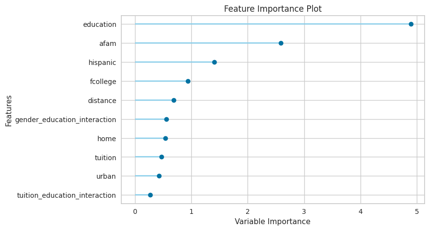
### Wykres Krzywej Uczenia
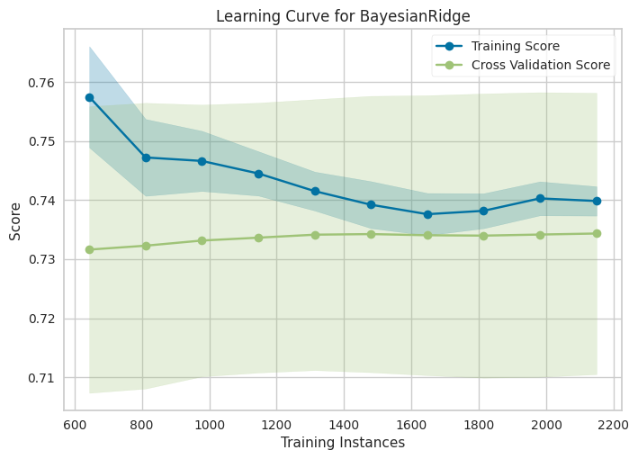
### Wykres Reszt
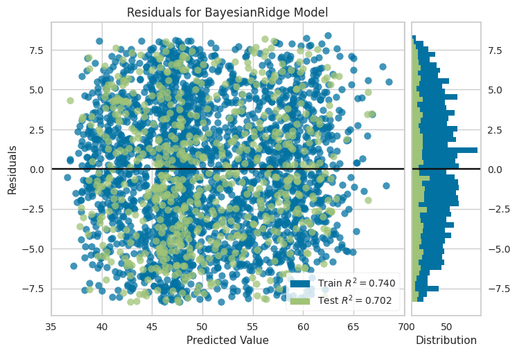
### Wykres Błędów Predykcji
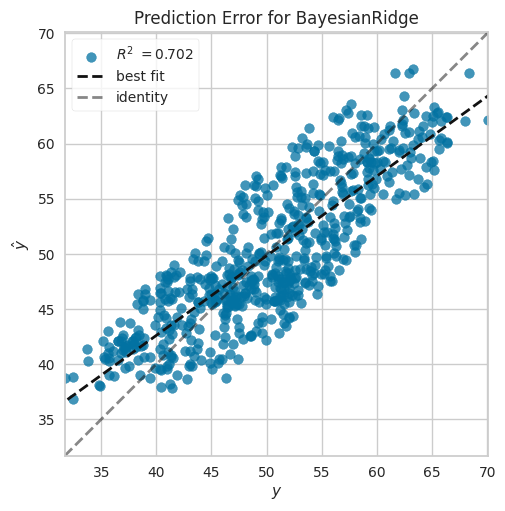
### Wykres Dystansu Cook'a
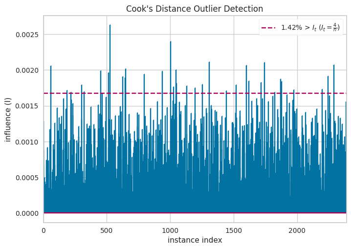
